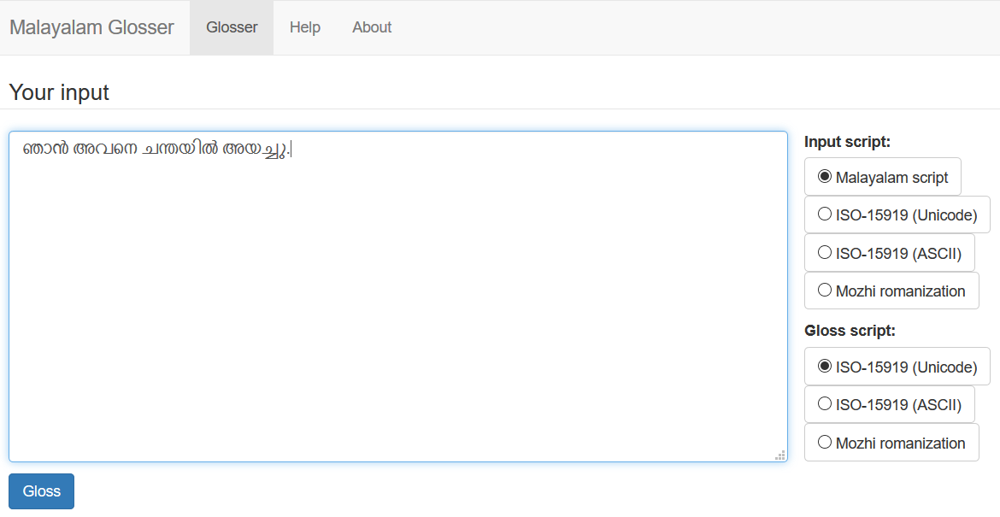
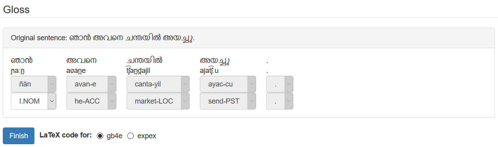
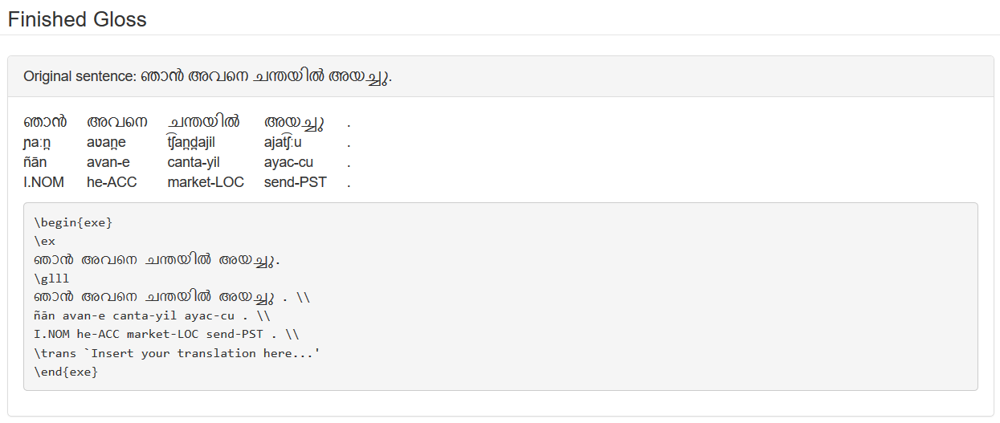

# Malayalam Glosser

The Malayalam Glosser is a web-based tool for automated creation of interlinear glosses for Malayalam texts. The morphological splits for the glosses were pregenerated by the MorphGen project (unpublished). While currently, the Glosser only displays the Malayalam interface, it can easily be extended to any other language (and currently already includes the data for my constructed language, Ryka). The Glosser's interface was developed using the Google Web Toolkit (GWT) and GWT-Bootstrap 3.

This is the semester project I did for the course "Industrial-Strength Multilingual Language Analysis" taught by Björn Rudzewitz and Johannes Dellert at the University of Tübingen in the winter semester 2017/18.

## About Interlinear Glosses (excerpt from term paper)

Interlinear glosses are word-to-word or morpheme-to-morpheme translations of a foreign language text that frequently accompany the free translations of examples in linguistic descriptions. The third line in (1) shows such an interlinear gloss for a Malayalam sentence.

```
(1)   സാറ കൂട്ടുകാരിക്ക് കടം കൊടുത്തു.
      sāṟa    kūṭṭukāri-kkŭ   kaṭaṁ   koṭut-tu
      Sarah   friend   -DAT   loan    give -PST
      "Sarah gave her friend a loan." (Asher and Kumari 1997, p. 62)
```

In contrast to the free translation which only conveys the meaning of the sentence, the gloss provides insights into the morphology and syntax of the source language. From (1) the reader can guess that Malayalam has SOV word order, a suffixing morphology, case marking and different tenses. For language learners, glosses can be particularly useful, since they highlight the differences in structure and meaning between the language that is being learned and a language that the learner already knows. Also, when trying to read a text in the foreign language, a free translation offers no insights as to why a particular phrase has a particular meaning and is therefore not helpful in learning the language. On the other hand, looking up unknown words in a dictionary to translate the text oneself can be frustrating and futile when there are unknown grammatical morphemes in the text that cannot be translated or even identified. In a sense, an interlinear gloss is like an informed dictionary lookup which can be very useful and insightful for language learners trying to understand a new text.

From a computational perspective, glosses are also easier to produce automatically than free translations, since they do not require any contextual information and do not have to sound natural. A morphological analyzer that can identify the individual morphemes a word is composed of and a large enough dictionary should be sufficient to produce a decent automatic glosser.

In this paper, I present such a glosser for Malayalam which was designed to be a useful tool for Malayalam students. To my knowledge, no comparable tool has been developed so far, since morphological analyzers for Malayalam are usually designed as preprocessors for applications such as part-of-speech (POS) taggers or machine translators.

## Usage

To launch the Glosser, load the project in Eclipse (with the GWT plugin installed) and run the `de.ws1718.ismla.gloss.client.ISMLAGlosser.java` as "GWT Development mode with Jetty". Eclipse will provide a link to the web application.



On the main page, you will be able to enter your Malayalam text and select the input script (in which you entered your text) and gloss script (in which the morpheme splits in the gloss are displayed). The Glosser supports the original Malayalam script (though not as a gloss script since it is a syllabic script), the ISO-15919 or National Library at Kolkata romanization (Unicode and ASCII version) and the Mozhi romanization. Please refer to the term paper for discussions of these scripts.



After having entered your text, click "Gloss" to reveal an editable gloss. Dropdowns enable you to switch between alternative splits and glossings for individual words (when they are ambiguous). In case you wish to display this gloss in a LaTeX document, the Glosser can also provide you with the LaTeX code for either of the two popular linguistic example packages `gb4e` and `expex`.



